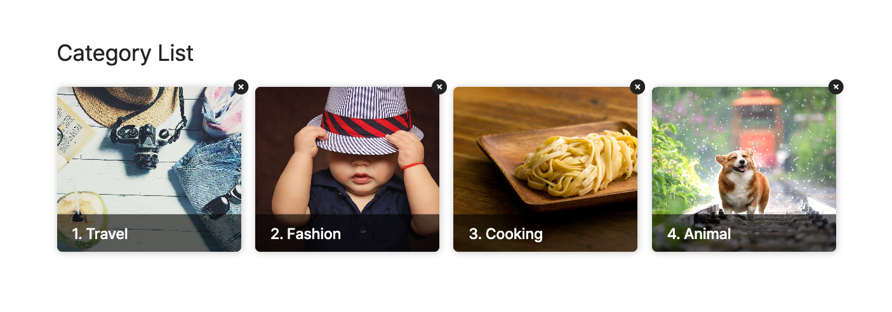

# [ 설연휴 미니 프로젝트 완성 과정 ]

## [ 제작시 신경쓴 부분과 중요 포인트 ]

### 1. HTML/CSS

- [x] HTML : 짧지만 구조적인 설계 연습
- [x] CSS : 반응형 페이지를 위한 미디어 쿼리 연습
- [x] CSS : rem 단위 사용 연습
- [x] CSS : 변수 지정 및 변수 사용 연습 (theme.css)

### 2. JavaScript

- [x] 범쌤과 만들었던 유틸 라이브러리 활용 연습
- [x] 프로젝트 초기값 셋팅 연습 (npm,git,gitignore,eslint 등...)
- [x] 클라이언트 + 서버 구동 (로컬에 있는 Json 파일 사용 연습을 위해)
- [x] Ajax 통신으로 로컬 Json 파일 데이터 불러오는 연습
- [ ] Ajax 통신으로 실시간 데이터 변경 연습 (추가/삭제/수정)
- [ ] 클릭 이벤트 연습 및 버블링 고려하여 제작 연습

---

## [ 제작 과정 ]

### 0. 초기값 셋팅

- `npm init -y` : 프로젝트 초기화 (package.json 생성)
- `npm install -D live-server` : 라이브 서버 설치
- `"start": "npx live-server client --host=localhost --port=5500 --no-browser"` : 라이브 서버 구동 단축어 추가 - package.json (npm start)
- `npm install -D json-server` : json 서버 설치
- `"serve": "npx json-server server/data/data.json"` : 스크립트에 구동할 서버 추가 (serve 라는 단축어로 사용가능)
- `npm install -D npm-run-all` : 클라이언트와 서버를 한번에 구동하는 도구 설치 (npm run all)
- `npm init @eslint/config` : eslint 초기화 (eslintrc.js 생성)
- `git init` : git 저장소 생성 (main branch 생성)
- `npx add-gitignore macos node visualstudiocode windows` : gitignore 생성

### 1.HTML/CSS 마크업

- 카드에 들어갈 내용(이미지,타이틀,설명,삭제버튼)에 맞게 구조적인 마크업
- flex를 사용하여 레이아웃 배치 및 position,overflow 속성을 사용하여 타이틀만 보이도록 스타일
- reflow 를 고려하여 마우스 hover 시 텍스트가 움직이는 것을 transform으로 제어
- transition 을 사용하여 부드러운 hover 효과 추가
- fontawsome 을 활용하여 아이콘 배치 (삭제 아이콘)
- 미디어 쿼리를 사용하여 반응형으로 제작 / 공통, 모바일, 테블릿, 데스크탑으로 css를 나누어 제작

### 2. 유틸 라이브러리 불러오기 (범쌤과 만들었던 lib 폴더)

### 3. 마크업한 카드를 하나의 컴포넌트로 저장 (createCard() 함수)

### 4. 만든 카드 컴포넌트를 DOM에 뿌려보기

- insertLast 함수를 활용하여 card-container 안에 카드 뿌려지는지 테스트

### 5. Ajax 통신으로 json 파일 연동

- jihoon.get 함수를 활용하여 로컬에 있는 data.json 파일의 데이터를 가져옴
- try catch 를 사용하여 json 파일을 불러오지 못했을 상황을 고려
- DOM에서 실시간으로 데이터를 불러오고 수정/삭제가 가능하도록 async await를 사용

### 6. 연동된 데이터를 카드 컴포넌트에 넣고 DOM에 뿌리기

-

# [ 완성된 모습 ]

